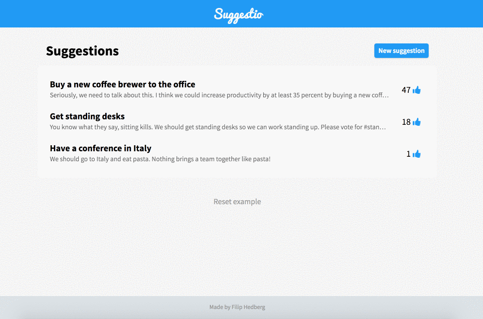
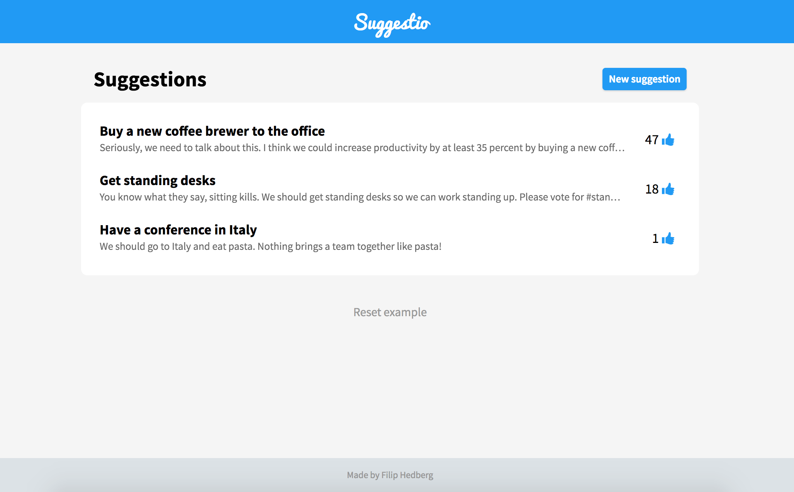
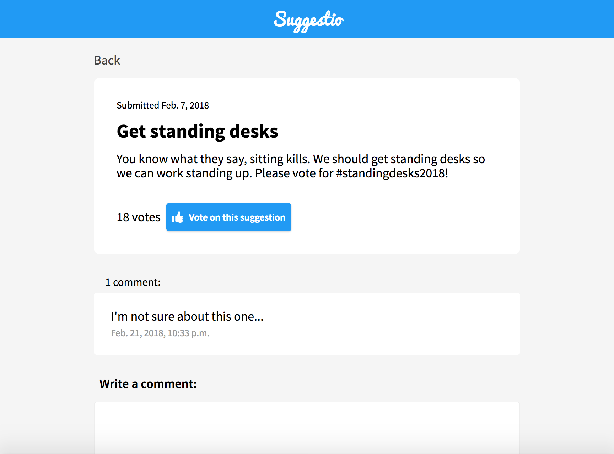

# suggestio

Meet Suggestio - a simple suggestion board web app.

#### Table of Contents

- [Introduction](#introduction)
- [Features](#features)
- [Tech/framework](#tech)
- [Limitations](#limitations)
- [Licence](#licence)

## Introduction 
Suggestio is a simple web app for collaborating on things, such as suggestions or ideas.  

## Features 

#### Demo

#### Features
- View suggestions, their comments and vote count
- Submit new suggestions
- Vote on suggestions
- Comment on suggestions

The admin interface supports:
- Delete/edit suggestions, comments and votes.

#### Screenshots

## Tech/framework used 
Built with:
- Django version 2.0.2 (Python)
- mysql
- HTML
- CSS

## Limitations and known shortcomings 

#### Technical limitations
- Not fit for deployment
- No tests included
- Doesn't handle all edge cases, such as pagination or lazy loading large number of suggestions or comments.
- CSS could be refactored further to follow BEM standard

#### Functional limitations
- Anonymous - no users
- Allows multiple votes on same suggestion
- Fixed order on suggestion list. Could add sorting by date, number of comments, etc...

## Motivation
This project was made for practicing the Django framework, as well as putting HTML and CSS to good use.

## Licence 
The code in this project is licensed under MIT license.
